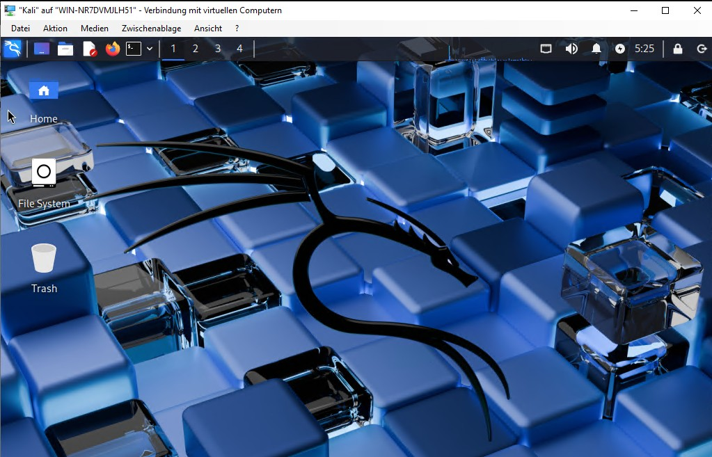

# FATJON PRRONI | IT Specialist for System Integration (Umschulung)

Tel: +4915209017791 | Email: fatjonprroni@gmail.com

---

## Welcome to My Home Lab Project

This project began in November 2025 and will be continuously updated until May 2026. The goal of this Home Lab is to **implement as much as possible of what I learn in school** and to **deepen my skills** in the field of IT with projects that involve physical computers and VMs.

The language used in the documentation of this Home Lab is English, as it is anticipated that at least one of the "employees" will only speak English until they learn German. 😊

---

## Hardware Used: The Physical Home Lab Infrastructure

I built my Home Lab from a mix of existing hardware. This includes the vocational school's virtual environment (Hyper-V Remote Lab), my personal computers that I use daily in school, and three old PCs.

In addition, I purchased a **2-Port Network Interface Card (NIC)**, a **Managed Layer 2 Switch**, Ethernet cables, and IT tools.

---

## The Core Network Devices (Core Infrastructure)

These devices form the basis for Layer 2 and Layer 3 segmentation and traffic separation.

| Device | Model / Type | Role in the Home Lab |
| :--- | :--- | :--- |
| **Dedicated PC (Firewall)** | **DELL** | **pfSense** (Physical) \| Traffic Control, Inter-VLAN Routing, Security (Layer 3) \| Low-end (2+ NICs) |
| **Quad-Core Switch** | **Managed Layer 2 Switch** | Basic Segmentation (Trunk G0/1), Physical VLANs \| Layer 2 |
| **Hypervisor Host** | **Acer Travelmate P216 (16 GB RAM)** | Workstation Host for VMs and Services (e.g., DNS/AD) \| VLAN 30 |

---

## Test Clients

These devices are used to emulate end-users and test the rules I have configured in the pfSense firewall.

| Device | Operating System | Special Characteristics |
| :--- | :--- | :--- |
| **Client A (Admin)** | **Windows 11 Pro** \| I5-1335U, 16 GB RAM | Administration \| Routing / Admin Workstation (VLAN 30) |
| **Client B** | **Windows 8.1 Pro** \| Celeron N3050, 4 GB RAM | **Standard Client** (VLAN 40) |
| **Client C** | **OS X El Capitan** \| Core i7, 4 GB RAM | **Client** \| **Connectivity Test** / Mac OS X Compatibility |

---

## Phase 1 Plan:: Network Setup and Topology Description

My Home Lab network plan utilizes a hybrid architecture: it is physically structured as an Extended Star Topology, while logically operating as an Industry-Standard Router-on-a-Stick (RoaS), using a Cisco Catalyst 2960-C Switch for controlled segmentation.

Extended Star Topology: All end devices, including the Hypervisor Host and administrative workstations, are individually connected via dedicated cables to the central switching hub, which is the Cisco Switch. This setup is highly reliable and simplifies physical troubleshooting.

Logically, the network utilizes the Router-on-a-Stick (RoaS) architecture to enforce segmentation via VLANs (1, 30, and 40). This model is built on a single TRUNK link between the Cisco 2960-C Switch (handling Layer 2 segmentation) and the pfSense Firewall (handling Layer 3 routing). This ensures all traffic passing between the VLANs is subjected to strict security policies defined on the pfSense firewall.

### 1.1. Preparing the Physical Firewall

A critical step in setting up the home lab was ensuring the necessary network capacity by creating a dedicated firewall device. A Dell computer was used as the host for pfSense.

#### A) Purchase and Installation of the Multi-Port Network Interface Card (NIC)

The Dell device (or any other device) requires multiple physical ports to effectively manage traffic: one for the **WAN** connection (Internet) and at least one more for the **TRUNK/LAN** connection to the Cisco managed switch (Layer 2).

 

For this, a **2-Port Network Interface Card (NIC)** had to be installed in the free PCI-e slot of the Dell device. The goal was to ensure the physical separation of WAN traffic from internal network traffic (LAN/VLAN).

       

During work on the computer, I ensured that an anti-static mat and a wrist strap were used to prevent damage to the computer components from static electrical discharge.

#### B) Initial Installation and Configuration of pfSense

After the hardware installation, the pfSense operating system was installed directly onto the hard drive of the Dell device. This required a USB drive (min. 8 GB), Balena Etcher, and the pfSense image. First, I installed it, and then i connect to the pfSense interface from a laptop, removing the keyboard and monitor from the pfSense computer.

### 1.2. Preparing the Ethernet Cables

For my plan, I needed additional Ethernet cables for connections. I needed a cable to connect pfSense to the Router, one to connect pfSense to the Switch, and several other Ethernet cables to connect the Switch to the other computers.

I bought a long cable, which was cut into parts as needed, and the **RJ45 connectors** were assembled using the appropriate tool. I used the **T568B standard**, which arranges the colors in this order (with the connector tab facing down): 1. White/Orange, 2. Orange, 3. White/Green, 4. Blue, 5. White/Blue, 6. Green, 7. White/Brown, and 8. Brown.

### 1.3. Segmentation into 3 VLANs

I configured pfSense and created 2 new VLANs. I left the default VLAN to manage pfSense and the Switch until we create a dedicated Management VLAN, after which we will convert the default VLAN into a **Blackhole VLAN**.

Initially, I created 2 VLANs:

* **VLAN 30** for the **IT Department** (where we will have servers, Hyper V, databases, etc.).
* **VLAN 40** for **Employees** (*Mitarbeiter*), where all other employees will be located.

This provides three main benefits:

1.  **Security and Isolation:** VLANs logically segment the network, preventing devices in one group from seeing or communicating directly with devices in another group, unless you specifically allow it with rules in pfSense. If a computer in VLAN 40 is infected with a virus, its spread is limited within that VLAN and cannot easily move to IT devices or the Router.
2.  **Performance and Traffic Management:** VLANs help reduce the size of the **Broadcast Domain**. This increases efficiency by resulting in less network load for both other employees and the IT department.
3.  **Organization:** VLANs make our network more organized and easier to manage. We immediately know if an IP belongs to the IT Department or an Employee, which helps us solve problems faster. We can also create specific rules in the Firewall for IT and for the other employees.

I performed the necessary configurations in pfSense and create the 2 VLANs, activating the **DHCP server** on pfSense for these VLANs.  Computers will then receive IP addresses from these networks.

I tested **ping**, but it did not work without making the necessary changes in the Firewall. 

After creating a new rule in the firewall and activating **File and Printer Sharing** for private networks, a ping from 192.168.30.10 to 192.168.30.11 successfully worked. The reverse also worked.

### 1.4. Switch Configuration

While performing the necessary configurations in pfSense, I do the same on the Switch. I connect the Switch to the laptop with a **console cable**, where the necessary configurations are carried out in **MobaXterm**.

### 1.5. Port Tagging

We have 2 ports on pfSense: 1 for WAN, which we connect to the main router, and 1 to connect to the **TRUNK** port of the Switch.

These two ports are tagged as follows:

| pfSense Port | Role |
| :--- | :--- |
| **WAN** | pfSense: WAN |
| **LAN/TRUNK** | pfSense: LAN (Trunk Interface) |

On the Switch, we have ports which we tag as follows:

| Switch Port | Role | Configuration | Tagging Notes |
| :--- | :--- | :--- | :--- |
| **Gi0/1 (TRUNK)** | Trunk Port (Connects to pfSense LAN/TRUNK) | "Switchport mode Trunk" | SW: Gi0/1 (Trunk) - Pfsense: LAN-IF |

We also tag the other ports as follows:

| Switch Port(s) | Role | Configuration | Tagging Notes |
| :--- | :--- | :--- | :--- |
| **Fa 0/1** | IT Admin - Hyper V Host (VLAN 30) | Access Port for VLAN 30 | SW: Fa 0/1 (V30) - Pc – IT - 01 |
| **Fa 0/2** | IT Department (VLAN 30) | Access Port for VLAN 30 | SW: Fa 0/2 (V30) - Pc – IT - 02 |
| **Fa 0/3** | Client C (VLAN 40) | Access Port for VLAN 40 | SW: Fa 0/3 (V40) - Pc – IT - 05 |
| **Fa 0/4** | Client D (VLAN 40) | Access Port for VLAN 40 | SW: Fa 0/4 (V40) - Pc – IT - 06 |
| **Fa 0/5** | Printer | Access Port for VLAN 1 | SW: Fa 0/5 (V1) - Printer HP |

If we want to connect, let us say 4 computers to Port 1, and 3 computers to Port 2, we can do this by using unmanaged switches connected to these access ports.

## Phase 2: Windows Server Environment Setup in Remotelab (Hyper-V)

Here I detail the plan to set up an environment of **five (5) Virtual Machines (VMs)** inside a single host VM created in my Remotelab. The goal was to test and compare different methods of deploying virtual machines.

### 2.1. Initial Setup and Nested Virtualization Attempt

As the first step, I created a Virtual Machine in the Remotelab environment named **VMHOSTFP1988**.

* I then configured this VM to run **Nested Virtualization** using a PowerShell command, turning it into a Hyper-V host itself (the **Hypervisor**).
* Inside **VMHOSTFP1988**, I created five different Virtual Machines (my workload VMs) using three distinct methods:
    * **Method 1: Hyper-V Manager**
        * Created a **second-generation** VM named **FP_DC**.
        * Used the Windows Server 2022 ISO image.
        * Connected it to a **Private virtual switch** to ensure communication only within the Remotelab environment.

      
  **Method 2: Windows Admin Center (WAC)**
        * Arranged the creation of a new VM named **FPServer1**.

  
        
  **Method 3: PowerShell Scripting**
        * Used a PowerShell command to create a VM named **FPServer2**, specifying the hard disk location, name, and ISO image path.

  

### 2.2. Problem Identified: Deep Nested Virtualization

The setup initially appeared correct in both the Windows Admin Center and Hyper-V Manager. 

However, **unexpected interruptions occurred**, and the root cause was identified as the use of **Level 4 Nested Virtualization**:

* **Level 1:** Physical Host
* **Level 2:** Intermediate Hypervisor (**WIN-ILAOICTCTN9N**)
* **Level 3:** Nested Hypervisor (**VMHostFP1988**)
* **Level 4:** Workload VMs (FP_DC, FPServer1, etc.)

**Hyper-V does not officially support or guarantee functionality beyond two levels of nesting.** The CPU virtualization extensions fail to pass through to the deepest level, causing the VM failures.

### 2.3. Confirmed Solution

To resolve the issue and flatten the lab environment, the following action is required:

* **Delete VMHOSTFP1988 (Level 3)**.
* **Create all Workload VMs (FP_DC, FPServer1, FPServer2, etc.) directly inside the WIN-ILAOICTCTN9N VM (Level 2).**

This configuration reduces the nesting to a supported three levels total (Level 1 → Level 2 → Level 3).

## 2.4. Environment Verification

Following the successful implementation of the solution (reducing the nesting level), the core functionality of the virtual network was verified.

* **Network Connectivity Test:** Connectivity between the virtual machines was successfully tested using the **ping** utility.
* **Firewall Configuration:** Appropriate changes were made to the software firewall settings on the VMs to allow for successful communication and testing.

This confirms that the new, supported nesting level allows for proper virtual machine operation and inter-VM communication within the Remotelab environment.

# Phase 3 Plan: Integrated Virtual Training Network (Hyper-V)

Here I plan to integrate a virtual environment into my existing physical Home Lab, serving as a comprehensive platform for practicing **efficient deployment**, **OS management (Dual Boot)**, **network configuration**, and **traffic analysis (Monitoring)**.

My Primary Objectives are:
* **Integration:** Seamlessly connect the Hyper-V network to the physical **VLAN 30** subnet via the host's NIC and the pfSense gateway.
* **Efficiency:** Validate the use of a **Master Windows Base Hard Disk (VHDX)** and **Differencing Disks** for rapid, space-saving deployment of multiple target systems.
* **Skill Development:** Create a versatile training network featuring a **Kali Linux monitoring station** and **Windows Target VMs** configured for **Dual Boot** practice.

The entire virtual subnet will reside logically within my physical VLAN 30 boundary, utilizing the existing pfSense Layer 3 routing capabilities.

---

## Network Architecture Summary (VLAN 30 Subnet)

| Component | Function / Practice Area | Connection Point | IP Scheme |
| :--- | :--- | :--- | :--- |
| **Virtual Switch** | External Switch (`VLAN30_Bridge`) | Physical NIC (VLAN 30 Access Port) | N/A |
| **Gateway / Firewall** | pfSense (Physical) | Cisco Switch (Trunk Port) | **192.168.30.1** |
| **Training VM 1** | Kali Linux / Monitoring & Analysis | `VLAN30_Bridge` | **192.168.30.10** |
| **Training VMs (x3)** | Windows/Linux / Dual Boot & Base Disk Practice | `VLAN30_Bridge` | **192.168.30.20-22** |

---

## Kali Linux VM Configuration

This Virtual Machine serves as the dedicated monitoring and analysis station within the integrated training network.

| Setting | Configuration | Rationale |
| :--- | :--- | :--- |
| **Operating System** | Kali Linux | Platform for network analysis (Wireshark) and security tooling. |
| **Virtual Switch** | **External Switch** (`VLAN30_Bridge`) | Allows the VM to communicate directly with the physical **VLAN 30** subnet via pfSense. |
| **RAM** | **2048 MB (2 GB)** | Sufficient for running the base OS and Wireshark for analysis. |
| **Virtual Processors** | **2 Cores** | Provides adequate processing power for concurrent network capture and tool usage. |
| **IP Address** | **Static: 192.168.30.10** | Ensures the monitor is always accessible and correctly routed by pfSense. |

---

**Status Update:** The Kali Linux VM is now successfully provisioned with the specified resources...

---

**Work in Progress...**

