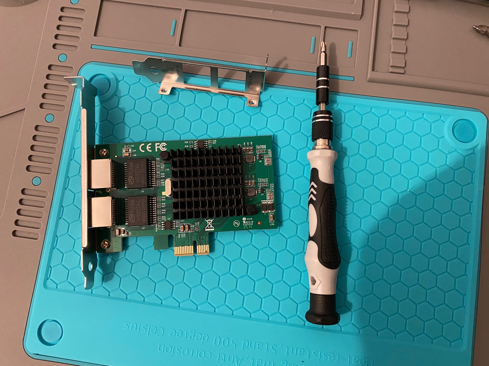

# FATJON PRRONI | IT Specialist for System Integration (Umschulung)

Tel: +4915209017791 | Email: fatjonprroni@gmail.com

---

## Welcome to My Home Lab Project

This project began in November 2025 and will be continuously updated until May 2026. The goal of this Home Lab is to **implement as much as possible of what I learn in school** and to **deepen my skills** in the field of IT with projects that involve physical computers and VMs.

The language used in the documentation of this Home Lab is English, as it is anticipated that at least one of the "employees" will only speak English until they learn German. 😊

---

## Hardware Used: The Physical Home Lab Infrastructure

I built my Home Lab from a mix of existing hardware. This includes the vocational school's virtual environment (Hyper-V Remote Lab), my personal computers that I use daily in school, and three old PCs.

In addition, I purchased a **2-Port Network Interface Card (NIC)**, a **Managed Layer 2 Switch**, Ethernet cables, and IT tools.

---

## The Core Network Devices (Core Infrastructure)

These devices form the basis for Layer 2 and Layer 3 segmentation and traffic separation.

| Device | Model / Type | Role in the Home Lab |
| :--- | :--- | :--- |
| **Dedicated PC (Firewall)** | **DELL** | **pfSense** (Physical) \| Traffic Control, Inter-VLAN Routing, Security (Layer 3) \| Low-end (2+ NICs) |
| **Quad-Core Switch** | **Managed Layer 2 Switch** | Basic Segmentation (Trunk G0/1), Physical VLANs \| Layer 2 |
| **Hypervisor Host** | **Acer Travelmate P216 (16 GB RAM)** | Workstation Host for VMs and Services (e.g., DNS/AD) \| VLAN 30 |

---

## Test Clients

These devices are used to emulate end-users and test the rules I have configured in the pfSense firewall.

| Device | Operating System | Special Characteristics |
| :--- | :--- | :--- |
| **Client A (Admin)** | **Windows 11 Pro** \| I5-1335U, 16 GB RAM | Administration \| Routing / Admin Workstation (VLAN 30) |
| **Client B** | **Windows 8.1 Pro** \| Celeron N3050, 4 GB RAM | **Standard Client** (VLAN 40) |
| **Client C** | **OS X El Capitan** \| Core i7, 4 GB RAM | **Client** \| **Connectivity Test** / Mac OS X Compatibility |

---

## 1. Plan: Network Setup with VLANs and pfSense

The plan is to build a network using **Virtual Local Area Networks (VLANs)**, a dedicated **pfSense Firewall** on a physical computer, and a **Managed Switch**.

### 1.1. Preparing the Physical Firewall

A critical step in setting up the home lab was ensuring the necessary network capacity by creating a dedicated firewall device. A Dell computer was used as the host for pfSense.

#### A) Purchase and Installation of the Multi-Port Network Interface Card (NIC)

The Dell device (or any other device) requires multiple physical ports to effectively manage traffic: one for the **WAN** connection (Internet) and at least one more for the **TRUNK/LAN** connection to the Cisco managed switch (Layer 2).

 

For this, a **2-Port Network Interface Card (NIC)** had to be installed in the free PCI-e slot of the Dell device. The goal is to ensure the physical separation of WAN traffic from internal network traffic (LAN/VLAN).

       

During work on the computer, we ensure that an anti-static mat and a wrist strap are used to prevent damage to the computer components from static electrical discharge.

#### B) Initial Installation and Configuration of pfSense

After the hardware installation, the pfSense operating system was installed directly onto the hard drive of the Dell device. This required a USB drive (min. 8 GB), Balena Etcher, and the pfSense image. First, we install it, and then we connect to the pfSense interface from a laptop, removing the keyboard and monitor from the pfSense computer.

### 1.2. Preparing the Ethernet Cables

For our plan, we need additional Ethernet cables for connections. We need a cable to connect pfSense to the Router, one to connect pfSense to the Switch, and several other Ethernet cables to connect the Switch to the other computers.

I bought a long cable, which was cut into parts as needed, and the **RJ45 connectors** were assembled using the appropriate tool. We are using the **T568B standard**, which arranges the colors in this order (with the connector tab facing down): 1. White/Orange, 2. Orange, 3. White/Green, 4. Blue, 5. White/Blue, 6. Green, 7. White/Brown, and 8. Brown.

### 1.3. Segmentation into 3 VLANs: 1 Default LAN and 2 Dedicated VLANs

We configure pfSense and create 2 new VLANs. We leave the default LAN to manage pfSense and the Switch until we create a dedicated Management VLAN, after which we will convert the default LAN into a **Blackhole VLAN**.

Initially, we create 2 VLANs:

* **VLAN 30** for the **IT Department** (where we will have servers, databases, etc.).
* **VLAN 40** for **Employees** (*Mitarbeiter*), where all other employees will be located.

This provides three main benefits:

1.  **Security and Isolation:** VLANs logically segment the network, preventing devices in one group from seeing or communicating directly with devices in another group, unless you specifically allow it with rules in pfSense. If a computer in VLAN 40 is infected with a virus, its spread is limited within that VLAN and cannot easily move to IT devices or the Router.
2.  **Performance and Traffic Management:** VLANs help reduce the size of the **Broadcast Domain**. This increases efficiency by resulting in less network load for both other employees and the IT department.
3.  **Organization:** VLANs make our network more organized and easier to manage. We immediately know if an IP belongs to the IT Department or an Employee, which helps us solve problems faster. We can also create specific rules in the Firewall for IT and for the other employees.

We perform the necessary configurations in pfSense and create the 2 VLANs, activating the **DHCP server** on pfSense for these VLANs. Our computers will then receive IP addresses from these networks.

We tested **ping**, but it did not work without making the necessary changes in the Firewall. After creating a new rule in the firewall and activating **File and Printer Sharing** for private networks, a ping from 192.168.30.10 to 192.168.30.11 successfully worked. The reverse also worked.

### 1.4. Switch Configuration

While performing the necessary configurations in pfSense, we must do the same on the Switch. We connect the Switch to the laptop with a **console cable**, where the necessary configurations are carried out in **MobaXterm**.

### 1.5. Port Tagging

We have 2 ports on pfSense: 1 for WAN, which we connect to the main router, and 1 to connect to the **TRUNK** port of the Switch.

These two ports are tagged as follows:

| pfSense Port | Role |
| :--- | :--- |
| **WAN** | pfSense: WAN |
| **LAN/TRUNK** | pfSense: LAN (Trunk Interface) |

On the Switch, we have ports which we tag as follows:

| Switch Port | Role | Configuration | Tagging Notes |
| :--- | :--- | :--- | :--- |
| **Gi0/1 (TRUNK)** | Trunk Port (Connects to pfSense LAN/TRUNK) | `switchport mode trunk` | SW: Gi0/1 (Trunk) - Pfsense: LAN-IF |

We also tag the other ports as follows:

| Switch Port(s) | Role | Configuration | Tagging Notes |
| :--- | :--- | :--- | :--- |
| **Fa 0/1** | Client A (VLAN 30) | Access Port for VLAN 30 | SW: Fa 0/1 (V30) - Pc – IT - 01 |
| **Fa 0/2** | Client B (VLAN 30) | Access Port for VLAN 30 | SW: Fa 0/2 (V30) - Pc – IT - 02 |
| **Fa 0/3** | Client C (VLAN 40) | Access Port for VLAN 40 | SW: Fa 0/3 (V40) - Pc – IT - 05 |
| **Fa 0/4** | Client D (VLAN 40) | Access Port for VLAN 40 | SW: Fa 0/4 (V40) - Pc – IT - 06 |
| **Fa 0/5** | Printer | Access Port for VLAN 1 | SW: Fa 0/5 (V1) - Printer HP |

If we want to connect 4 computers to Port 1, and 3 computers to Port 2, we can do this by using unmanaged switches connected to these access ports.

---

## Next Steps

* **Create VLAN for Management:** In the following steps, we will create a separate VLAN for the management of the printer, Switch, pfSense, etc.
* **Install Kali Linux with Wireshark:** We will install a Kali Linux VM with Wireshark in Hyper-V to monitor network traffic.
* **Blackhole VLAN:** VLAN 1 will be converted into a Blackhole VLAN to secure the network.
