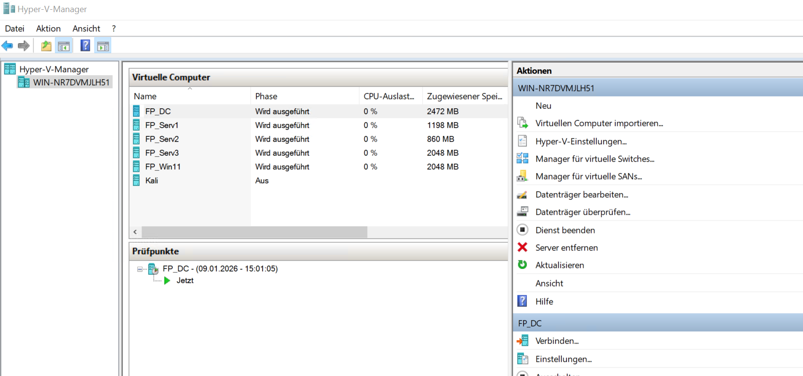
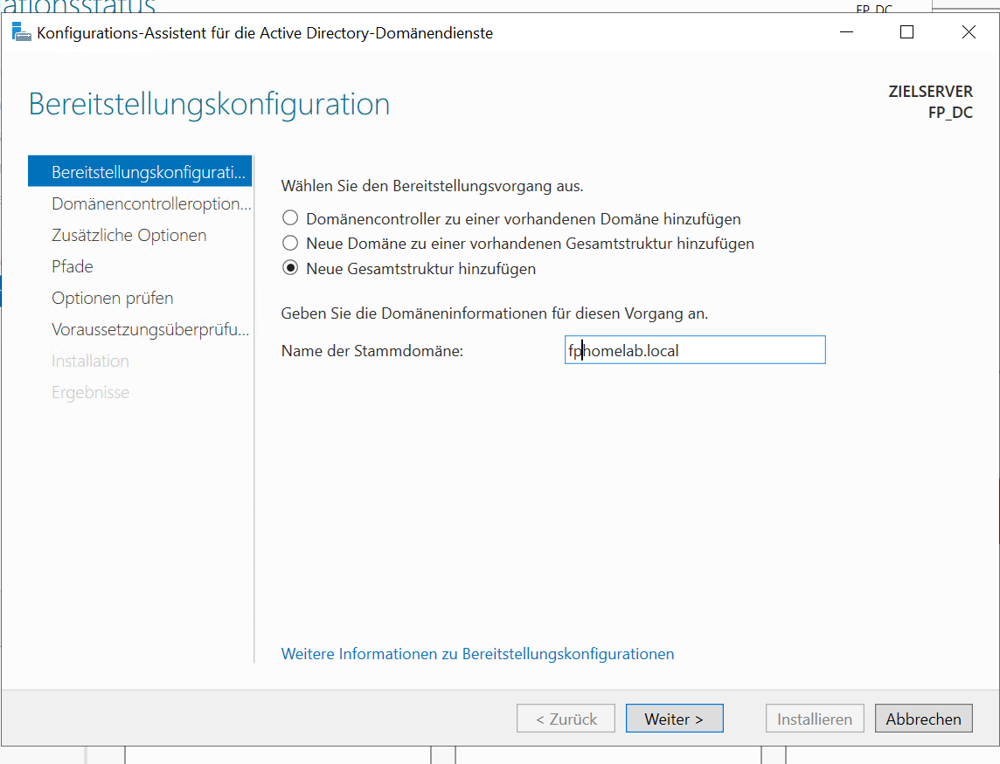
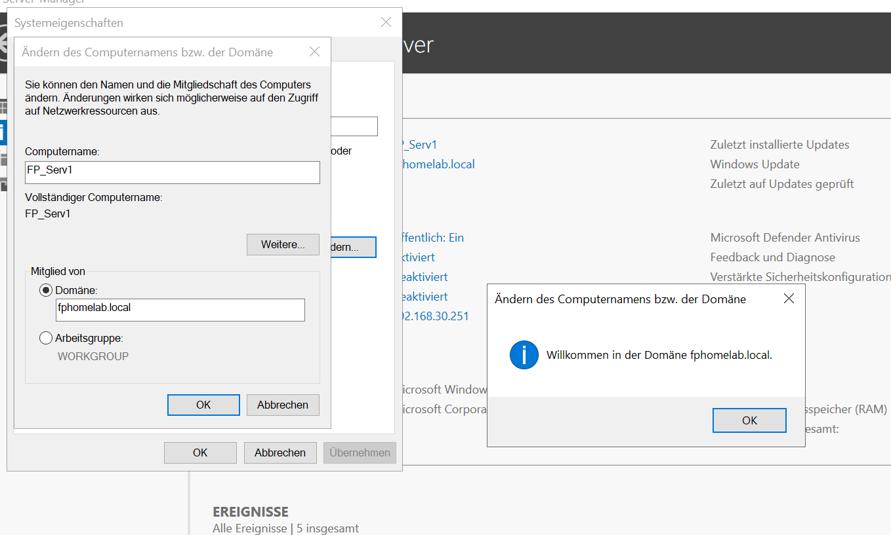
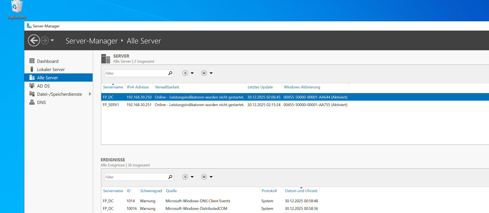
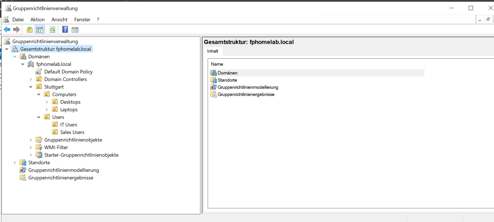
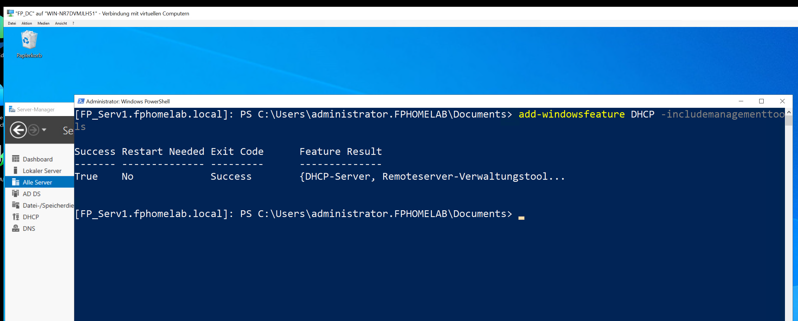
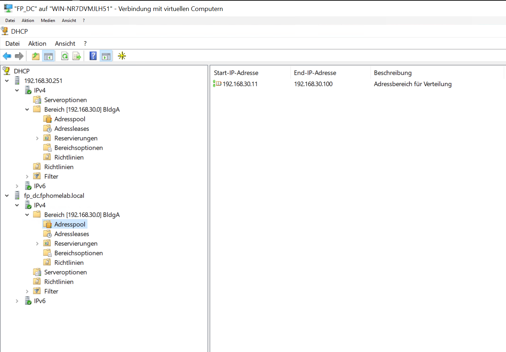
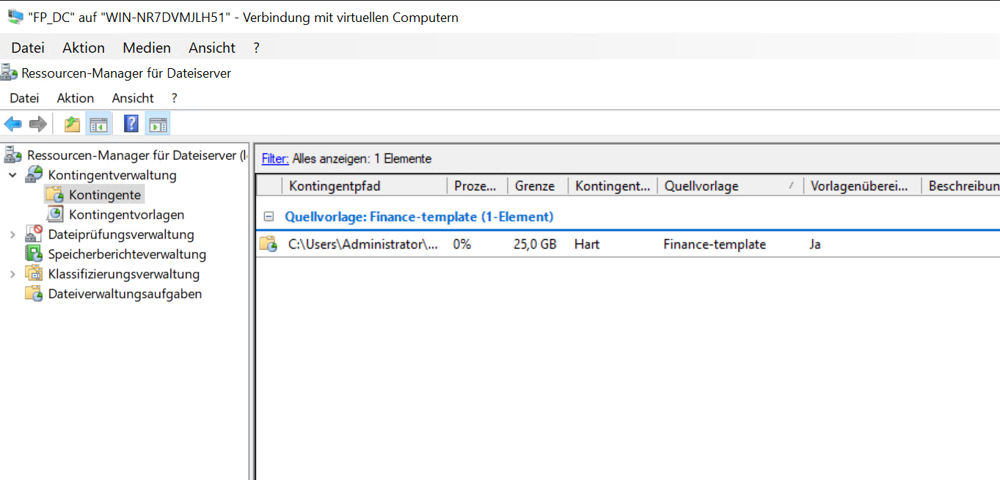

# FATJON PRRONI | Fachinformatiker für Systemintegration (FISI) - (Umschulung)

Tel: +4915209017791 | Email: fatjonprroni@gmail.com

---
# Willkommen zu meinem Home-Lab Projekt

Dieses Projekt begann im November 2025 und wird bis Mai 2026 kontinuierlich erweitert. Das Ziel dieses Home-Labs ist es, **die im Unterricht erlernten Inhalte so weit wie möglich praktisch umzusetzen** und meine **IT-Kenntnisse durch Projekte mit physischer Hardware und virtuellen Maschinen (VMs) zu vertiefen**.

---

## Verwendete Hardware: Die physische Infrastruktur

Mein Home-Lab wurde aus einer Mischung vorhandener Hardware aufgebaut. Dazu gehören die virtuelle Umgebung der Berufsschule (Hyper-V Remote Lab), meine täglich in der Schule genutzten PCs sowie drei ältere Rechner.

Zusätzlich habe ich eine **2-Port-Netzwerkkarte (NIC)**, einen **Managed Layer-2-Switch**, Ethernet-Kabel und diverses IT-Werkzeug erworben.

---

## Kern-Netzwerkkomponenten (Core Infrastructure)

Diese Geräte bilden die Basis für die Segmentierung auf Layer 2 und Layer 3 sowie für die Trennung des Datenverkehrs.

| Gerät | Modell / Typ | Rolle im Home-Lab |
| :--- | :--- | :--- |
| **Dedizierter PC (Firewall)** | **DELL** | **pfSense** (Physisch) \| Datenverkehrskontrolle, Inter-VLAN-Routing, Sicherheit (Layer 3) \| Low-End (2+ NICs) |
| **Zentraler Switch** | **Managed Layer 2 Switch** | Basis-Segmentierung (Trunk G0/1), Physische VLANs \| Layer 2 |
| **Hypervisor Host** | **Acer Travelmate P216 (16 GB RAM)** | Workstation-Host für VMs und Dienste (z. B. DNS/AD) \| VLAN 30 |

---

## Test-Clients

Diese Geräte werden verwendet, um Endanwender zu simulieren und die in der pfSense-Firewall konfigurierten Regeln zu testen.

| Gerät | Betriebssystem | Besondere Merkmale |
| :--- | :--- | :--- |
| **Client A (Admin)** | **Windows 11 Pro** \| i5-1335U, 16 GB RAM | Administration \| Routing / Admin-Workstation (VLAN 30) |
| **Client B** | **Windows 8.1 Pro** \| Celeron N3050, 4 GB RAM | **Standard-Client** (VLAN 40) |
| **Client C** | **OS X El Capitan** \| Core i7, 4 GB RAM | **Client** \| **Konnektivitätstests** / macOS-Kompatibilität |

---

## Phase 1: Netzwerkplan und Topologiebeschreibung

Mein Netzwerkplan nutzt eine hybride Architektur: Physisch ist das Netzwerk als **erweiterte Stern-Topologie** strukturiert, während es logisch als industriestandardmäßiges **Router-on-a-Stick (RoaS)**-Konzept arbeitet. Zur kontrollierten Segmentierung wird ein Cisco Catalyst 2960-C Switch eingesetzt.

### Physischer Aufbau (Erweiterte Stern-Topologie)
Alle Endgeräte, einschließlich des Hypervisor-Hosts und der Admin-Workstations, sind über dedizierte Kabel direkt mit dem zentralen Switch verbunden. Dieser Aufbau ist hochgradig zuverlässig und vereinfacht die physische Fehlersuche.

### Logische Struktur (Router-on-a-Stick)
Das Netzwerk nutzt die **Router-on-a-Stick (RoaS)**-Architektur, um die Segmentierung über VLANs (1, 30 und 40) zu erzwingen. Dieses Modell basiert auf einer einzelnen **TRUNK-Verbindung** zwischen dem Cisco 2960-C Switch (zuständig für Layer-2-Segmentierung) und der pfSense-Firewall (zuständig für Layer-3-Routing). Dadurch wird sichergestellt, dass der gesamte Datenverkehr zwischen den VLANs die strengen Sicherheitsrichtlinien der pfSense-Firewall durchlaufen muss.

### 1.1 Vorbereitung der physischen Firewall

Ein entscheidender Schritt beim Aufbau des Home-Labs war die Sicherstellung der notwendigen Netzwerkkapazität durch die Einrichtung eines dedizierten Firewall-Geräts. Ein Dell-Computer wurde als Host für pfSense verwendet.

#### A) Kauf und Installation der Multi-Port-Netzwerkkarte (NIC)

Das Dell-Gerät (oder jedes andere dedizierte Gerät) benötigt mehrere physische Ports, um den Datenverkehr effektiv zu verwalten: einen für die **WAN**-Verbindung (Internet) und mindestens einen weiteren für die **TRUNK/LAN**-Verbindung zum verwalteten Cisco-Switch (Layer 2).

 

Dafür musste eine **2-Port-Netzwerkkarte (NIC)** in den freien PCIe-Steckplatz des Dell-Geräts eingebaut werden. Das Ziel war es, die physische Trennung des WAN-Datenverkehrs vom internen Netzwerkverkehr (LAN/VLAN) zu gewährleisten.

       

Während der Arbeiten am Computer wurde sichergestellt, dass eine Antistatik-Matte und ein Erdungsarmband verwendet wurden, um Schäden an den Computerkomponenten durch elektrostatische Entladungen (ESD) zu vermeiden.

#### B) Erstinstallation und Konfiguration von pfSense

Nach der Hardware-Installation wurde das pfSense-Betriebssystem direkt auf die Festplatte des Dell-Geräts installiert. Hierfür wurden ein USB-Stick (mind. 8 GB), Balena Etcher und das pfSense-Image benötigt. Zuerst führte ich die Installation durch und griff anschließend über einen Laptop auf die pfSense-Benutzeroberfläche zu, woraufhin Tastatur und Monitor vom pfSense-Rechner entfernt wurden.

---

### 1.2. Vorbereitung der Ethernet-Kabel

Für die Umsetzung meines Plans benötigte ich zusätzliche Ethernet-Kabel. Erforderlich waren ein Kabel für die Verbindung von pfSense zum Router, eines für die Verbindung von pfSense zum Switch sowie mehrere weitere Ethernet-Kabel, um den Switch mit den anderen Computern zu verbinden.

Ich habe ein langes Verlegekabel gekauft, das je nach Bedarf zugeschnitten wurde. Die **RJ45-Stecker** wurden mit dem entsprechenden Werkzeug (Crimpzange) montiert. Dabei habe ich den **T568B-Standard** verwendet, bei dem die Adern in folgender Reihenfolge angeordnet sind (mit der Steckernase nach unten): 
1. Weiß/Orange,
2. Orange
3. Weiß/Grün
4. Blau
5. Weiß/Blau
6. Grün
7. Weiß/Braun
8.  Braun

### 1.3 Segmentierung in 3 VLANs

Ich habe pfSense konfiguriert und zwei neue VLANs erstellt. Das Standard-VLAN (Default) wurde vorerst beibehalten, um pfSense und den Switch zu verwalten, bis ein dediziertes Management-VLAN eingerichtet wird. Danach wird das Standard-VLAN in ein **Blackhole-VLAN** umgewandelt.

Initial wurden folgende zwei VLANs erstellt:

* **VLAN 30** für die **IT-Abteilung**: Hier werden Server, Hyper-V-Hosts, Datenbanken und andere kritische Dienste betrieben.
* **VLAN 40** für **Mitarbeiter**: In diesem Segment befinden sich alle regulären Arbeitsplatzrechner der Angestellten.

Dies bietet drei wesentliche Vorteile:

1. **Sicherheit und Isolierung:** VLANs segmentieren das Netzwerk logisch und verhindern, dass Geräte einer Gruppe direkt mit Geräten einer anderen Gruppe kommunizieren können – es sei denn, dies wird explizit durch Regeln in der pfSense erlaubt. Falls ein Computer in VLAN 40 mit einem Virus infiziert wird, bleibt die Ausbreitung auf dieses VLAN beschränkt und kann nicht ohne Weiteres auf IT-Geräte oder den Router übergreifen.
2. **Performance und Traffic-Management:** VLANs tragen dazu bei, die Größe der **Broadcast-Domain** zu reduzieren. Dies steigert die Effizienz, da die Netzwerklast sowohl für die regulären Mitarbeiter als auch für die IT-Abteilung verringert wird.
3. **Organisation:** VLANs machen unser Netzwerk übersichtlicher und einfacher zu verwalten. Wir wissen sofort, ob eine IP-Adresse zur IT-Abteilung oder zu einem Mitarbeiter gehört, was die Fehlerbehebung beschleunigt. Zudem können wir spezifische Firewall-Regeln getrennt für die IT und die restlichen Mitarbeiter erstellen.

Ich habe die notwendigen Konfigurationen in pfSense vorgenommen, die beiden VLANs erstellt und den **DHCP-Server** auf der pfSense für diese Segmente aktiviert. Dadurch erhalten die Computer automatisch IP-Adressen aus den jeweiligen Netzwerken.

Beim anschließenden Testen der Verbindung mittels **Ping** stellte ich fest, dass dieser erwartungsgemäß nicht funktionierte, solange keine entsprechenden Anpassungen in den Firewall-Regeln vorgenommen wurden.

### Validierung der Konnektivität

Nachdem die grundlegende Infrastruktur stand, wurde die Kommunikation innerhalb der VLANs getestet. Hierbei mussten zwei Hürden überwunden werden: die Netzwerksegmentierung auf Firewall-Ebene und die lokale Host-Firewall der Windows-Clients.

#### Erfolgreicher ICMP-Test (Ping)
Nach der Erstellung einer entsprechenden Erlaubnisregel (Pass Rule) in der pfSense-Firewall und der Aktivierung der **Datei- und Druckerfreigabe** (welche die notwendigen ICMP-Echos in der Windows-Firewall zulässt), konnte die Konnektivität bestätigt werden:

* **Test:** Ping von `192.168.30.10` nach `192.168.30.11`
* **Ergebnis:** Erfolgreich (Antwortzeit <1ms)
* **Reversibler Test:** Der Ping in die umgekehrte Richtung war ebenfalls erfolgreich.

Dies verifiziert, dass die Clients im **VLAN 30 (IT-Abteilung)** wie geplant miteinander kommunizieren können, während sie gleichzeitig durch die pfSense von anderen Segmenten isoliert bleiben.

### 1.4. Konfiguration des Switches

Parallel zu den notwendigen Konfigurationen in pfSense wurden die entsprechenden Einstellungen am Switch vorgenommen. Dazu habe ich den Switch über ein **Konsolenkabel** mit dem Laptop verbunden und die Konfiguration in **MobaXterm** durchgeführt.

### 1.5. Port-Tagging und Interface-Zuweisung

Auf der pfSense wurden zwei physische Ports konfiguriert: Ein Port für das **WAN**, welches mit dem Hauptrouter verbunden ist, und ein Port für die Verbindung zum **TRUNK**-Port des Switches.

Diese beiden Ports sind wie folgt zugewiesen:

| pfSense Port | Rolle | Beschreibung |
| :--- | :--- | :--- |
| **WAN** | pfSense: WAN | Verbindung zum Internet / Hauptrouter |
| **LAN/TRUNK** | pfSense: LAN (Trunk-Interface) | Verbindung zum Cisco-Switch für VLAN-Tagging (802.1Q) |

Auf dem Switch wurden die Ports wie folgt konfiguriert und getaggt:

| Switch-Port | Rolle | Konfiguration | Tagging-Hinweise |
| :--- | :--- | :--- | :--- |
| **Gi0/1 (TRUNK)** | Trunk-Port (Verbindung zu pfSense LAN/TRUNK) | `switchport mode trunk` | SW: Gi0/1 (Trunk) – pfSense: LAN-IF |

Zusätzlich wurden die weiteren Ports wie folgt konfiguriert:

| Switch-Port(s) | Rolle | Konfiguration | Tagging-Hinweise |
| :--- | :--- | :--- | :--- |
| **Fa 0/1** | IT Admin - Hyper-V Host (VLAN 30) | Access-Port für VLAN 30 | SW: Fa 0/1 (V30) – PC-IT-01 |
| **Fa 0/2** | IT-Abteilung (VLAN 30) | Access-Port für VLAN 30 | SW: Fa 0/2 (V30) – PC-IT-02 |
| **Fa 0/3** | Client C (VLAN 40) | Access-Port für VLAN 40 | SW: Fa 0/3 (V40) – PC-IT-05 |
| **Fa 0/4** | Client D (VLAN 40) | Access-Port für VLAN 40 | SW: Fa 0/4 (V40) – PC-IT-06 |
| **Fa 0/5** | Drucker | Access-Port für VLAN 1 | SW: Fa 0/5 (V1) – Drucker HP |

Falls beispielsweise 4 Computer an Port 1 und 3 Computer an Port 2 angeschlossen werden sollen, kann dies durch den Einsatz von **Unmanaged Switches** erfolgen, die mit diesen Access-Ports verbunden werden.

---

## Phase 2: Aufbau der Windows Server-Umgebung im Remotelab (Hyper-V)

In dieser Phase beschreibe ich die Einrichtung einer Umgebung mit **fünf (5) virtuellen Maschinen (VMs)** innerhalb einer einzigen Host-VM in meinem Remotelab. Ziel war es, verschiedene Methoden zur Bereitstellung virtueller Maschinen zu testen und zu vergleichen.

### 2.1. Erstmalige Einrichtung und Nested Virtualization

Als ersten Schritt habe ich im Remotelab eine virtuelle Maschine mit dem Namen **VMHOSTFP1988** erstellt.

* Diese VM wurde mittels eines PowerShell-Befehls für **Nested Virtualization** konfiguriert, wodurch sie selbst zum Hyper-V-Host (**Hypervisor**) wurde.
* Innerhalb von **VMHOSTFP1988** habe ich fünf verschiedene virtuelle Maschinen (Workload-VMs) unter Verwendung von drei unterschiedlichen Methoden erstellt:
    * **Methode 1: Hyper-V Manager**
        * Erstellung einer VM der **2. Generation** mit dem Namen **FP_DC**.
        * Verwendung des Windows Server 2022 ISO-Images.
        * Anbindung an einen **privaten virtuellen Switch**, um die Kommunikation ausschließlich innerhalb der Remotelab-Umgebung zu gewährleisten.
          

      
* **Methode 2: Windows Admin Center (WAC)**
        * Erstellung einer neuen VM mit dem Namen **FPServer1**. Das Windows Admin Center wurde hierbei als moderne, webbasierte Oberfläche zur zentralen Verwaltung des Hyper-V-Hosts genutzt.

  
        
* **Methode 3: PowerShell-Scripting**
        * Verwendung eines PowerShell-Befehls zur Erstellung einer VM mit dem Namen **FPServer2**. Dabei wurden Parameter wie der Speicherort der Festplatte, der VM-Name und der Pfad zum ISO-Image direkt im Skript spezifiziert.

  

### 2.2. Identifiziertes Problem: Deep Nested Virtualization (Tiefe Schachtelung)

Das Setup schien anfangs sowohl im Windows Admin Center als auch im Hyper-V Manager korrekt konfiguriert zu sein.

Es traten jedoch **unerwartete Unterbrechungen** auf. Als Ursache wurde die Verwendung von **Nested Virtualization auf Ebene 4 (Level 4)** identifiziert:

* **Ebene 1:** Physischer Host
* **Ebene 2:** Zwischengeschalteter Hypervisor (**WIN-ILAOICTCTN9N**)
* **Ebene 3:** Verschachtelter (Nested) Hypervisor (**VMHostFP1988**)
* **Ebene 4:** Workload-VMs (FP_DC, FPServer1, etc.)

**Hyper-V unterstützt oder garantiert offiziell keine Funktionalität über zwei Verschachtelungsebenen hinaus.** Die CPU-Virtualisierungserweiterungen werden nicht bis zur tiefsten Ebene durchgereicht, was zu den Ausfällen der VMs führte.

### 2.3. Bestätigte Lösung

Um das Problem zu beheben und die Lab-Umgebung flacher zu gestalten ("Flattening"), wurde folgende Maßnahme ergriffen:

* **Löschung von VMHOSTFP1988 (Ebene 3).**
* **Erstellung aller Workload-VMs (FP_DC, FPServer1, FPServer2, etc.) direkt innerhalb der VM WIN-ILAOICTCTN9N (Ebene 2).**

Durch diese Konfiguration wird die Verschachtelung auf insgesamt drei unterstützte Ebenen reduziert (Ebene 1 → Ebene 2 → Ebene 3), was einen stabilen Betrieb ermöglicht.

## 2.4. Überprüfung der Umgebung (Environment Verification)

Nach der erfolgreichen Umsetzung der Lösung (Reduzierung der Verschachtelungstiefe) wurde die Kernfunktionalität des virtuellen Netzwerks überprüft.

* **Netzwerkkonnektivitätstest:** Die Verbindung zwischen den virtuellen Maschinen wurde erfolgreich mit dem Dienstprogramm **ping** getestet.
* **Firewall-Konfiguration:** An den Software-Firewall-Einstellungen der VMs wurden entsprechende Änderungen vorgenommen, um eine reibungslose Kommunikation und Tests zu ermöglichen.

Dies bestätigt, dass die neue, unterstützte Verschachtelungsebene einen ordnungsgemäßen Betrieb der virtuellen Maschinen und die Kommunikation zwischen den VMs innerhalb der Remotelab-Umgebung ermöglicht.

---

## Phase 3: Aufbau und Konfiguration der Active Directory Infrastruktur

In dieser Phase wurden die 7 Kernpunkte der Server-Infrastruktur im Remote-Lab umgesetzt, um eine vollständige Unternehmensumgebung zu simulieren.

### 1. Netzwerk-Setup (IP-Adressierung)
Alle Maschinen wurden statisch konfiguriert, um eine stabile Auflösung innerhalb der Domäne zu gewährleisten.

| Hostname | Betriebssystem | IP-Adresse | Rolle |
| :--- | :--- | :--- | :--- |
| **FP_DC** | Windows Server | 192.168.30.250 | Primary Domain Controller |
| **FP_Serv1** | Windows Server | 192.168.30.251 | Member Server (DHCP/DNS) |
| **FP_Serv2** | Windows Server | 192.168.30.252 | Member Server |
| **FP_Serv3** | Windows Server | 192.168.30.253 | Member Server |
| **FP_Win11** | Windows 11 | DHCP | Client Workstation |

### 2. Rollen und Features (AD DS Installation)
* **Installation**: Auf dem **FP_DC** wurden die **Active Directory-Domänendienste** installiert.
* **Stammdomäne**: Erstellung eines neuen Forests mit dem Namen **fphomelab.local**.
  

* **DNS**: Die DNS-Rolle wurde automatisch als AD-integrierte Instanz mitinstalliert.
* **Domänenbeitritt**: Der Server **FP_Serv1** wurde erfolgreich der Domäne hinzugefügt.

* **Zentralisierung**: Verbindung von FP_Serv1 mit dem **Server-Manager** des DC, um Remotearbeiten direkt vom Domain Controller aus zu ermöglichen.

### 3. Identitätsmanagement (OU & Global Catalogue)
* **Organisationseinheiten (OU)**: Erstellung einer spezifischen OU für den Standort **Stuttgart**.
* **Global Catalogue**: Konfiguration zur Optimierung der standortübergreifenden Objektsuche.
* **Gruppenrichtlinien (GPO)**: Arbeit an den Richtlinien zur Steuerung von Benutzerrechten und Sicherheitskonfigurationen.

  

### 4. DHCP-Server Bereitstellung
* **FP_DC**: Installation und Konfiguration des DHCP-Servers über die **GUI**.
* **FP_Serv1**: Installation des DHCP-Dienstes via **Remote PowerShell** vom DC aus:
  `Install-WindowsFeature DHCP -IncludeManagementTools`

    
* **DHCP Scope**: Erstellung und Konfiguration des Adressbereichs (Scopes) zur dynamischen IP-Vergabe.

    
    
* **Autorisierung**: Erfolgreiche Autorisierung der DHCP-Server im Active Directory.

### 5. DNS-Dienste und Redundanz
* **Installation auf FP_Serv1**: Ergänzende Installation der DNS-Rolle mittels PowerShell:
  `Install-WindowsFeature DNS -IncludeManagementTools`
* **DNS-Typen**: Evaluierung von Primary, Secondary und **Active Directory-integrated DNS** für optimale Namensauflösung in verschiedenen Lokationen.

### 6. Dateiserver-Management & FSRM
* **Dateifreigabe**: Testen verschiedener Freigabemethoden für OUs.
* **Berechtigungen**: Vergabe von NTFS-Rechten (Lesen, Modifizieren) sowie Anwendung von **Deny-Regeln**.
* **FSRM (File Server Resource Manager)**: Installation auf dem DC.
* **Kontingente**: Erstellung von **Quotas**, um die Erstellung von Ordnern mit einer Größe von mehr als **25 GB** zu verhindern.

   

### Nächste Schritte: Monitoring, Wireshark und Infrastruktur
Laufende Aktivitäten und zukünftige Erweiterungen:

* **Performance Monitoring**: Kontinuierliche Überwachung der Systemauslastung (CPU, RAM, Disk) der VMs.
* **Wireshark**: Analyse des Netzwerkverkehrs zur Fehlerdiagnose und Protokollvalidierung.
* **SAN Storage Integration**: Konfiguration von Shared Storage (iSCSI) zur Vorbereitung von Hochverfügbarkeitsszenarien.
* **Migration**: Vorbereitung und Durchführung von Migrationen für Daten, FSMO-Rollen und Dienste zwischen Member-Servern.
* **Backup & Recovery**: Planung und Test von Desaster-Recovery-Szenarien zur Sicherstellung der Business Continuity.
* **Kali Linux**: Integration in die Infrastruktur für Sicherheitsanalysen und Penetration Testing.

**In Bearbeitung / Work in Progress...**

